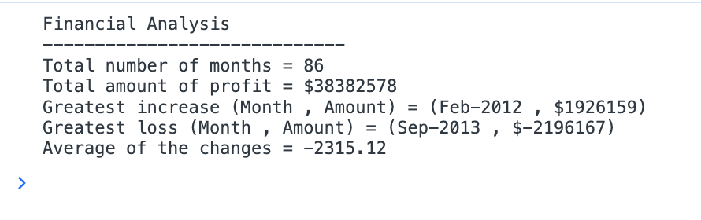

# Console-Finances-ahmed-s 

The purpose of the Console finances was to create a place to collect all the revenues and their months in one place as an array. 

I set multiple different for loops in order to find the average change as well as to calculate the greatest increase and decrease as well as their respective months. The number of months in total was set to the length of the array. 

https://ahmed-ibrahim20560.github.io/Console-Finances-ahmed-s/

https://github.com/ahmed-ibrahim20560/Console-Finances-ahmed-s

